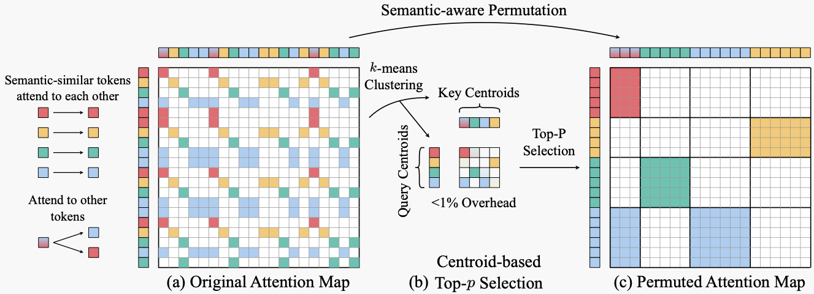
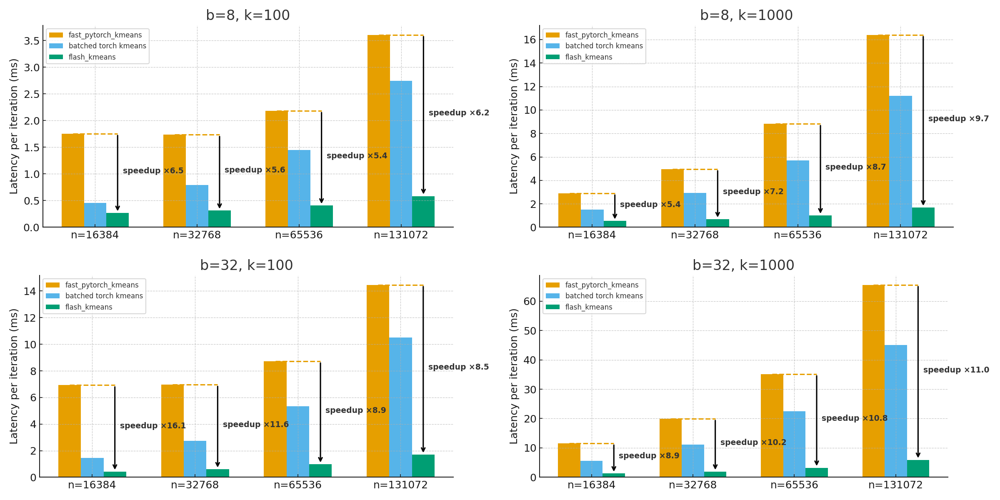

# Flash-KMeans

Fast batched K-Means clustering implemented with Triton GPU kernels. This repository provides the official K-Means implementation of [Sparse VideoGen2](https://arxiv.org/pdf/2505.18875).




## Installation

Install flash-kmeans with `pip`:

```bash
pip install flash-kmeans
```

From source:

```bash
git clone https://github.com/svg-project/flash-kmeans.git
cd flash-kmeans
pip install -e .
```

## Usage

```python
import torch
from flash_kmeans import batch_kmeans_Euclid

x = torch.randn(32, 75600, 128, device="cuda", dtype=torch.float16)
cluster_ids, centers, _ = batch_kmeans_Euclid(x, n_clusters=1000, tol=1e-4, verbose=True)
```

## Benchmark

Our Triton implementation brings significant performance improvements. Compared with a standard PyTorch [baseline](https://github.com/DeMoriarty/fast_pytorch_kmeans), it achieves **up to 16× speed-up** on an NVIDIA H100 GPU (FP16, batch size 32, 16k points, 128-D, 1k clusters).




## Citation

If you use this codebase, or otherwise found our work valuable, please cite:

```
@article{yang2025sparse,
  title={Sparse VideoGen2: Accelerate Video Generation with Sparse Attention via Semantic-Aware Permutation},
  author={Yang, Shuo and Xi, Haocheng and Zhao, Yilong and Li, Muyang and Zhang, Jintao and Cai, Han and Lin, Yujun and Li, Xiuyu and Xu, Chenfeng and Peng, Kelly and others},
  journal={arXiv preprint arXiv:2505.18875},
  year={2025}
}
```