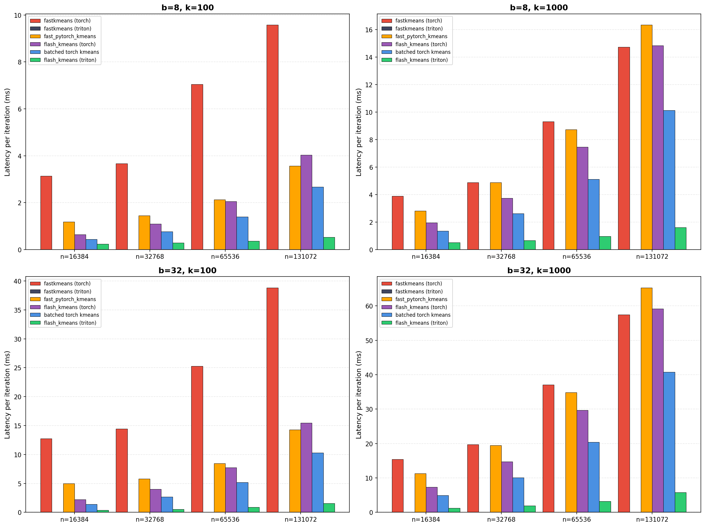
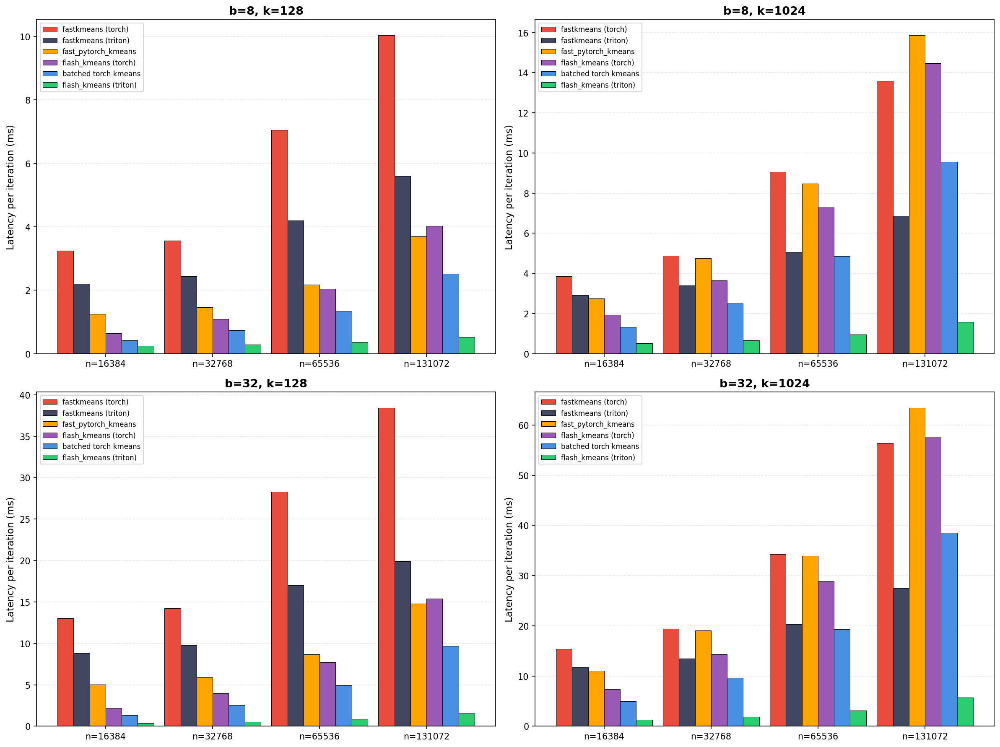
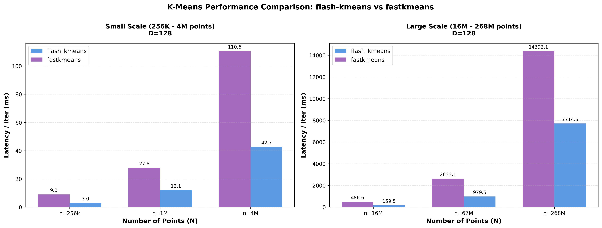

# Flash-KMeans

Fast batched K-Means clustering implemented with Triton GPU kernels. This repository provides the official K-Means implementation of [Sparse VideoGen2](https://arxiv.org/pdf/2505.18875).


## Installation

Install flash-kmeans with `pip`:

```bash
pip install flash-kmeans
```

From source:

```bash
git clone https://github.com/svg-project/flash-kmeans.git
cd flash-kmeans
pip install -e .
```

## Usage

```python
import torch
from flash_kmeans import batch_kmeans_Euclid

x = torch.randn(32, 75600, 128, device="cuda", dtype=torch.float16)
cluster_ids, centers, _ = batch_kmeans_Euclid(x, n_clusters=1000, tol=1e-4, verbose=True)
```

We also provide a API interface similar to `faiss/sklearn`, see [API docs](https://github.com/svg-project/flash-kmeans/blob/main/flash_kmeans/interface.py) for details.

## Benchmark


We compare the performance of our Triton implementation with the following baselines:
  - [fast_pytorch_kmeans](https://github.com/DeMoriarty/fast_pytorch_kmeans) a Pytorch implmentation of K-Means clustering.
  - [fastkmeans(triton) / fastkmeans(torch)](https://github.com/AnswerDotAI/fastkmeans) another triton implementation of K-Means clustering. (and its Pytorch fallback)
  - flash-kmeans(triton) / flash-kmeans(torch): our implementation in Triton and Pytorch fallback.
  - batched torch kmeans: a naive batch implementation without considering OOM. 

Tested on NVIDIA H200 GPU with FP16 precision, 128 demensional data, varying number of clusters (k), data points (n) and batch size (b). Our Triton implementation brings significant performance improvements. 




Note: fastkmeans(triton) get error when k=100 or k=1000 in figure 1.

### Large tensor Benchmark

For large input that cannot fit in GPU memory, we compare the performance with fastkmeans(triton) with FP32 precision, 128 demensional data, number if data points scaling from 256K to 268M  (N = 2^18, 2^20, 2^22, 2^24, 2^26, 2^28) with cluster counts following K = √N (512, 1024, 2048, 4096, 8192, 16384).

Input tensor is generated randomly in CPU pinned memory. both flash-kmeans and fastkmeans transfer data from CPU to GPU in chunk and compute.




## Citation

If you use this codebase, or otherwise found our work valuable, please cite:

```
@article{yang2025sparse,
  title={Sparse VideoGen2: Accelerate Video Generation with Sparse Attention via Semantic-Aware Permutation},
  author={Yang, Shuo and Xi, Haocheng and Zhao, Yilong and Li, Muyang and Zhang, Jintao and Cai, Han and Lin, Yujun and Li, Xiuyu and Xu, Chenfeng and Peng, Kelly and others},
  journal={arXiv preprint arXiv:2505.18875},
  year={2025}
}
```