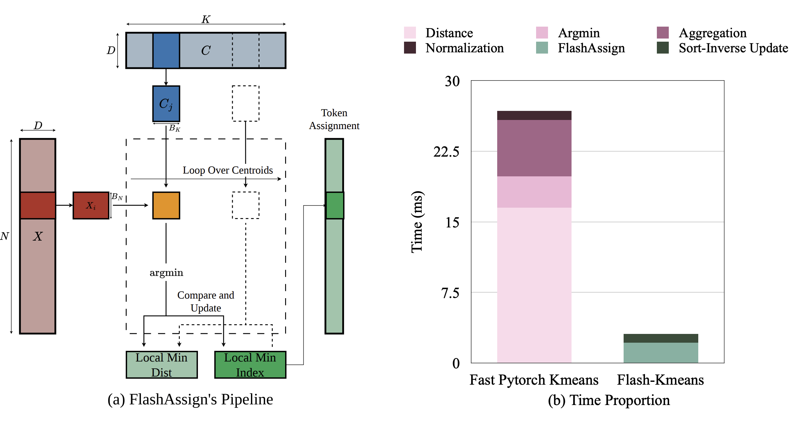
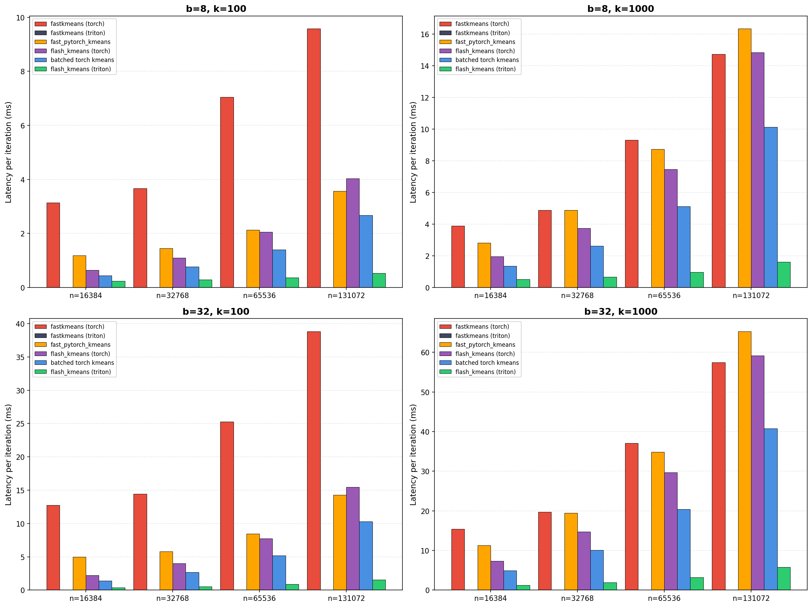
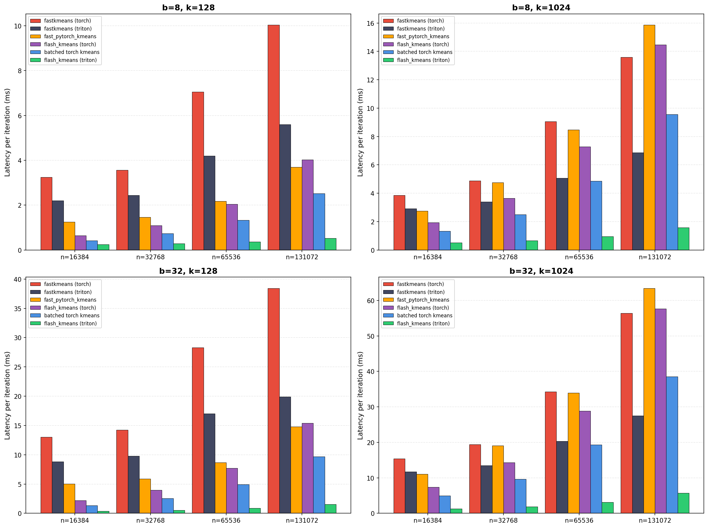
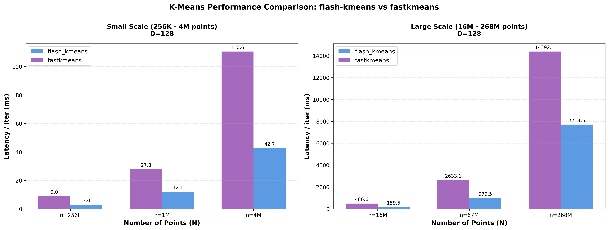

# Flash-KMeans

<p align="left">
| <a href="https://svg-project.github.io/"><b>Blog</b></a> | <a href="https://arxiv.org/abs/2603.09229"><b>Paper</b></a> | <a href="https://x.com/HaochengXiUCB/status/2033693755791052804"><b>Twitter/X</b></a> |
</p>

IO-aware batched K-Means clustering implemented with Triton GPU kernels. This repository provides the official K-Means implementation of [Sparse VideoGen2](https://arxiv.org/pdf/2505.18875).




## Installation

Install flash-kmeans with `pip`:

```bash
pip install flash-kmeans
```

From source:

```bash
git clone https://github.com/svg-project/flash-kmeans.git
cd flash-kmeans
pip install -e .
```

## Usage

```python
import torch
from flash_kmeans import batch_kmeans_Euclid

x = torch.randn(32, 75600, 128, device="cuda", dtype=torch.float16)
cluster_ids, centers, _ = batch_kmeans_Euclid(x, n_clusters=1000, tol=1e-4, verbose=True)
```

We also provide a API interface similar to `faiss/sklearn`, see [API docs](https://github.com/svg-project/flash-kmeans/blob/main/flash_kmeans/interface.py) for details.

## Benchmark


We compare the performance of our Triton implementation with the following baselines:
  - [fast_pytorch_kmeans](https://github.com/DeMoriarty/fast_pytorch_kmeans) a Pytorch implmentation of K-Means clustering.
  - [fastkmeans(triton) / fastkmeans(torch)](https://github.com/AnswerDotAI/fastkmeans) another triton implementation of K-Means clustering. (and its Pytorch fallback)
  - flash-kmeans(triton) / flash-kmeans(torch): our implementation in Triton and Pytorch fallback.
  - batched torch kmeans: a naive batch implementation without considering OOM. 

Tested on NVIDIA H200 GPU with FP16 precision, 128 demensional data, varying number of clusters (k), data points (n) and batch size (b). Our Triton implementation brings significant performance improvements. 




Note: fastkmeans(triton) get error when k=100 or k=1000 in figure 1.

### Large tensor Benchmark

For large input that cannot fit in GPU memory, we compare the performance with fastkmeans(triton) with FP32 precision, 128 demensional data, number if data points scaling from 256K to 268M  (N = 2^18, 2^20, 2^22, 2^24, 2^26, 2^28) with cluster counts following K = √N (512, 1024, 2048, 4096, 8192, 16384).

Input tensor is generated randomly in CPU pinned memory. both flash-kmeans and fastkmeans transfer data from CPU to GPU in chunk and compute.



### Large-D and dtype support

The Triton assign kernel ships in two flavours and dispatches between them
automatically based on input shape and dtype:

- **Small-D path** (existing kernel, `D ≤ 512`): one program loads `x_tile (BN, D)`
  once and streams over centroids in `BLOCK_K` chunks. Per-arch heuristics
  (H200, H100, A100, GB10) pick `(BLOCK_N, BLOCK_K, num_warps, num_stages)` based
  on a hand-tuned table derived from `flash-kmeans-tune` grid sweeps.
- **Split-D path** (new, `D > 512` or whenever the small-D kernel cannot fit
  shared memory at minimum tile size): outer K loop, inner D loop tiled by
  `BLOCK_D`. The cross accumulator `(BN, BK)` is held in registers across the
  D loop, so the K-streaming property (no `(B, N, K)` distance matrix
  materialised) is preserved.

**Unknown GPUs**: when the GPU does not match any of the tuned families
(H200/H100/A100/GB10), the wrapper unconditionally dispatches to the
split-D kernel with a conservative fallback config (`BLOCK_N=32, BLOCK_K=32,
BLOCK_D=32, num_warps=4, num_stages=1`). This avoids any reliance on
per-arch tuning data we don't have, and the split-D path's
`_fit_config_to_smem_split_d` post-process guarantees the launch fits
shared memory regardless of the actual budget. Performance will be
suboptimal on unfamiliar architectures — re-tune via
[flash-kmeans-tune](https://github.com/svg-project/flash-kmeans-tune)
to populate the corresponding `_heuristic_euclid_config_<arch>_largeD`
function.

The dispatch is automatic — no API changes:

```python
from flash_kmeans import FlashKMeans
km = FlashKMeans(d=2048, k=1024, dtype=torch.float32)  # large-D + fp32 ok
km.train(data)
```

### Multi-GPU Support

For large-N workloads (`kmeans_largeN`), flash-kmeans now supports automatic multi-GPU scaling. When `device=None`, all available GPUs are used automatically; specifying a single device (e.g. `device="cuda:0"`) falls back to single-GPU mode. No new API parameters are needed.

The multi-GPU pipeline extends the single-GPU double-buffered streaming design with:

- **Data partitioning across GPUs**: The N data points are split into contiguous block partitions, one per GPU. Each GPU independently runs its own double-buffered H2D + compute pipeline over its partition, so PCIe bandwidth scales linearly with GPU count.
- **Lightweight AllReduce via manual gather-reduce-broadcast**: After all GPUs finish their local accumulation, partial centroid sums (~4 MB) and counts (~32 KB) are gathered to GPU 0 via D2D copies (NVLink), reduced, and the new centroids are broadcast back. No NCCL dependency — the data is small enough that manual copies are faster and keep everything in a single process.
- **H2D / D2D overlap**: H2D transfers use PCIe while the AllReduce uses NVLink — different hardware paths that can run concurrently. The first H2D block of the next iteration is prefetched during the current iteration's AllReduce, hiding the reduce latency behind the transfer.

```python
from flash_kmeans import FlashKMeans

# Automatically uses all visible GPUs for large-N CPU data
km = FlashKMeans(d=128, k=8192, niter=100)
labels = km.fit_predict(large_cpu_tensor)  # device=None → multi-GPU
```


## Citation

If you use this codebase, or otherwise found our work valuable, please cite:

```
@article{yang2026flash,
  title={Flash-KMeans: Fast and Memory-Efficient Exact K-Means},
  author={Yang, Shuo and Xi, Haocheng and Zhao, Yilong and Li, Muyang and Fan, Xiaoze and Zhang, Jintao and Cai, Han and Lin, Yujun and Li, Xiuyu and Keutzer, Kurt and others},
  journal={arXiv preprint arXiv:2603.09229},
  year={2026}
}

@article{yang2025sparse,
  title={Sparse VideoGen2: Accelerate Video Generation with Sparse Attention via Semantic-Aware Permutation},
  author={Yang, Shuo and Xi, Haocheng and Zhao, Yilong and Li, Muyang and Zhang, Jintao and Cai, Han and Lin, Yujun and Li, Xiuyu and Xu, Chenfeng and Peng, Kelly and others},
  journal={arXiv preprint arXiv:2505.18875},
  year={2025}
}
```
